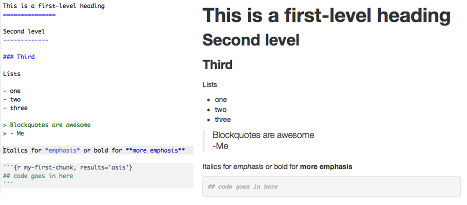

class: inverse, middle, center
##What is Knitr?

-It is a dynamic report generator

-It is a package that can process several different document formats such as PDF's, Word documents, slide presentations and web pages

      -It enables the integration of R code into Latex, Lyx, HTML 
      and many others

-Aids in reproducible research by integrating computing and reporting from several sources simulataneously


---
class: inverse, middle, center
##How do you load it?

-Download R Markdown from CRAN

-library(knitr)

-knitr::

-"knit" button


---
class: inverse, middle, center
## What can it do?

#This is an example of knitr with Markdown

```{r echo=FALSE}

```
---

The equivalent text in html

```{r echo=FALSE}

```
---

And, the equivalent test in Latex

```{r echo=FALSE}
knitr::include_graphics("tex1.png")
```

---
class: inverse, middle, center

##"Future proof"

    -Can integrate data regardless of software version
    
    -Access all notes, graphs, text, animation etc. 
    in one place


---
class: inverse, middle, center
## References

#https://yihui.name/knitr/

#https://kbroman.org/knitr_knutshell/pages/Rmarkdown.html

#https://sachsmc.github.io/knit-git-markr-guide/knitr/knit.html

#https://en.m.wikipedia.org/wiki/Knitr